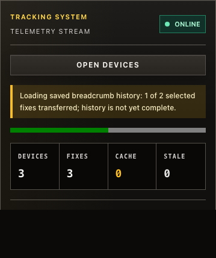

# DON-254 bounded transport evidence

Local candidate is the accumulated diff against `d20bae5fd8156a61e92a9b8fd68c87b2ca614a37`.
Package receipt records that base as HEAD and truthfully records dirty source;
its packaged input hashes and client hash bind the tested implementation.
It is not an exact-head CI claim. Final Linux CI/review verdicts are recorded
on [PR23](https://github.com/donal0c/sartracker-web/pull/23).

## Source and regression controls

- [Preserved red](preserved-red.log): old boundary rejected; 21 failed / 10 passed.
- [Oversized record red](oversized-record-red.log): full-row parse exceeded 16,384 units before fragmentation.
- [Stable serial correctness](source-correctness.log): 441 files passed, one failed;
  4,593 tests passed, one failed, six intentionally skipped in correctness mode.
  Failure was `ENOENT` hashing the deleted tracked whole-result runner before
  its deletion was staged. No application/test code was changed to cure it.
  [Affected complete file after staging](kill-matrix-indexed-deletion.log): 30/30 pass.
  Owner then requested a durable harness repair: [isolated deleted-file red](kill-missing-red.log)
  reproduces ENOENT; [31 affected tests pass](kill-missing-green.log) after recording
  only ENOENT as a stable missing marker. Other errors still throw and report-parent
  safety remains intact. Combined verified source result: 442 files / 4,595 passing tests, six skips.
  This is a failed cycle plus a diagnosed focused correction, not a freshly
  green full-cycle run. Exact-head CI will supply the clean complete cycle.
- [Lint](source-lint.log) and [build/bundle budgets](source-build.log) pass.
- [Browser missing-bar red](browser-progress-bar-red.log) and
  [corrected real-runtime/client flow](browser-progress-bar-green.log) retained.
  Source cycle interrupted to add the bar is retained locally as
  `tmp/don254-transport/source-interrupted-for-progress-bar.log`, not counted green.

## Rendered proof

Independent Astra review checked the captured five-item manifest: ONLINE,
three current devices/fixes, 1 of 2 historical fixes explicitly incomplete,
half-filled progress bar, and readable unclipped presentation. All five pass.
Provider/transport is controlled; this is a real browser/runtime/client/UI flow,
not live Traccar or field proof. Opus was not used under the task's model constraint.

## Actual macOS package

[Machine receipt](macos-package.json): actual ASAR worker/main/preload/contextBridge,
checkout production client transpiled/injected, SQLite selector digest oracle, 103,626 rows
then restart with 103,627 rows. Every ordered field matches, including an oversized
escaped string and non-finite altitude. Current writes are visible before historical
transfer completes. Both cancellation/stale-read checks and code-zero closes pass.

| Launch | Main maximum gap | Renderer maximum gap | Current write |
| --- | ---: | ---: | ---: |
| Initial | 53.977 ms | 18.8 ms | 1.7 ms |
| Restart | 54.695 ms | 17.2 ms | 2.4 ms |

All checks retain strict `<200 ms`. The preserved original 316–351 ms / 550 ms
Ubuntu/reference-profile failures are not overwritten by these different-platform
synthetic measurements. This is direct transport proof, not automatic hydration,
installed Linux artifact, live provider, full 36-hour workload, or release acceptance.
Follow-up B (~239 ms recovery) and whole-candidate BCP-17/WAR-12 qualification remain open.

The [strengthened closed-profile receipt](macos-closed-profile.json) additionally
binds every Electron dependency and identical ASAR hashes across launches. Setup
creates mission/devices through the package, closes cleanly, then seeds SQLite
while Electron is closed. Measured first/restart launches both pass exact digests,
cancellation and clean closes: main maxima 54.586/53.935 ms, renderer 19.5/17.5 ms,
current writes 2.0/2.9 ms. Client execution is explicitly checkout-source injection,
not invocation of the packaged renderer entry. No app rebuild or application
change separates the two receipts; the repeat validates strengthened harness custody.

## Final PR state

The [four-charter review disposition](reviews.md) records one confirmed P2,
stale progress/cleanup status from a replaced runtime. Its red reproduces both
paths; the active-generation correction passes all 92 runtime tests and the
rendered flow. Combined local verified correctness count is now 4,596 plus six
explicit correctness-mode skips. Unchanged transport/package evidence is reused;
the UI-generation correction is validated at its affected runtime/browser boundary.

This source receipt precedes final asynchronous CI/rechecks. Consult
[PR23](https://github.com/donal0c/sartracker-web/pull/23) for the exact final head,
Linux artifact receipts, broad/focused rechecks and terminal merge readiness.
No release acceptance is claimed.
